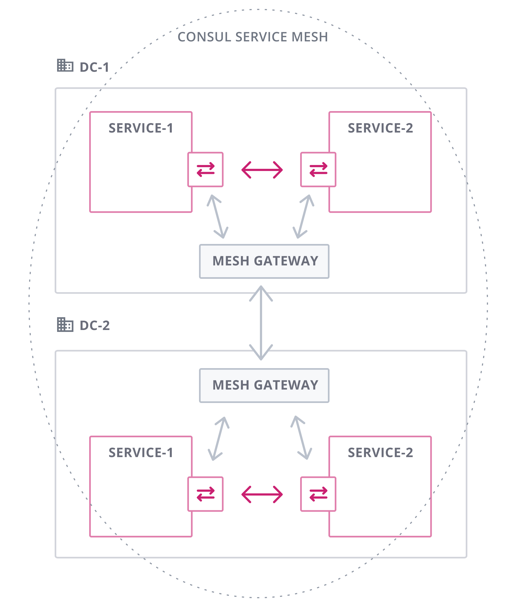

## What is a Service Mesh?

A service mesh is a configurable, low‑latency infrastructure layer designed to handle a high volume of network‑based inter-process communication among application infrastructure services using application programming interfaces. Service meshes alleviate common problems faced in distributed micro-services based architectures by securing inter-service communication, improving network resilience, providing automated service discovery, and offering zero-trust security between services.

## What is a Multi-Cluster Service Mesh?

A multi-cluster service mesh comprises a single service mesh that spans multiple Kubernetes clusters. The clusters in a multi-cluster setup can be distributed anywhere, such different data-centers, or even different cloud providers.

Multi-cluster deployments offer many advantages: high availability, as services can be deployed across different regions and zones. Increased security, with services distributed and isolated across multiple clusters. Extensive fault isolation and fail over routing, with the ability to configure how and where network traffic gets routed.

## Popular Service Mesh Solutions

The number of service mesh solutions maybe relatively small, but they're popularity is growing. Three of most popular service meshes are <a href="https://istio.io/latest">Istio</a>, <a href="https://www.consul.io/docs/connect">Hashicorps Consul Connect</a>, and <a href="https://linkerd.io/">Linkerd</a>, which are the solutions compared on this site. Other popular solutions include <a href="https://kuma.io">Kuma</a>, and <a href="https://traefik.io/traefik-mesh">Traefik Mesh</a>.

## Multi-Cluster Architectures
### Istio

Istio offers multiple multi-cluster deployment models and configurations. Istio categorises clusters as either primary, with the cluster containing a Istiod control plane component, and remote, with the cluster being managed by a control plane on a primary cluster. The deployment models are also split into two distinct topologies: network topologies (NT) and control plane topologies (CT), which are displayed below.

 

    

       <figure>
  
  <figcaption>Multi-Primary (CT)</figcaption>
</figure>
    

    

<figure>
        
<figcaption>Primary-Remote (CT)</figcaption>
</figure>
    

    

<figure>
        
  <figcaption>Network Multi-Primary (NT)</figcaption>
</figure>
    

    

<figure>
        
  <figcaption>Network Primary-Remote (NT)</figcaption>
</figure>
    

### Consul Connect

The act of joining two or more Kubernetes clusters together using Consul is termed multi-cluster federation, with each cluster seen as independent data centres. Consul federation provides WAN federation using mesh gateways. One cluster in the multi-cluster setup must be designated as a primary data centre, with all other clusters deemed secondary data centres. Mesh gateways enable routing of Connect traffic between different Consul data centres.

 

### Linkerd

Linkerds multi-cluster configuration uses a method called Service Mirroring, a technique developed in-house by Linkerd. Service mirroring replicates services from a remote cluster to a source cluster, giving each cluster a copy of all the remote clusters services. Service Mirroring allows services from a remote cluster to become a Kubernetes service on the host cluster, which pods on the host cluster can forward network traffic.

 

## Multi-Cluster Feature Comparison

 

<table>
	<tr>
		<th style="width:15%; border-top:2px solid #000000;" bgcolor="#e0e0e0"></th>
		<th style="width:20%; border-top:2px solid #000000;" bgcolor="#e0e0e0">
			
		</th>
		<th style="width:20%; border-top:2px solid #000000;" bgcolor="#e0e0e0">
			
		</th>
		<th style="width:20%; border-top:2px solid #000000;" bgcolor="#e0e0e0">
			
		</th>
	</tr>
	<tr style="background-color:#F0F8FF;border-top:2px solid #000000; border-bottom:2px solid #000000;">
		<td colspan="4">Installation and Operational Management</td>
	</tr>
	<tr>
		<td bgcolor="#e0e0e0">Installation</td>
		<td bgcolor="#e0e0e0">
			<li>CLI</li>
			<li>Helm Charts</li>
			<li>Operator</li>
		</td>
		<td bgcolor="#e0e0e0">
			<li>Helm Charts</li>
		</td>
		<td bgcolor="#e0e0e0">
			<li>CLI</li>
			<li>Helm Charts</li>
		</td>
	</tr>
	<tr>
		<td>Management</td>
		<td>
			<li>CLI</li>
			<li>UI (7 dashboards)</li>
			<li>Dedicated management component (Admiral)</li>
		</td>
		<td>
			<li>CLI</li>
			<li>UI (single dedicated dashboard)</li>
		</td>
		<td>
			<li>CLI</li>
			<li>UI (single dedicated dashboard and Grafana)</li>
		</td>
	</tr>
	<tr>
		<td bgcolor="#e0e0e0">Mesh Expansion</td>
		<td bgcolor="#e0e0e0">
			<li>Yes: single and multi-network support</li>
		</td>
		<td bgcolor="#e0e0e0">
			<li>Yes</li>
		</td>
		<td bgcolor="#e0e0e0">
			<li>No</li>
		</td>
	</tr>
	<tr style="background-color:#F0F8FF;border-top:2px solid #000000; border-bottom:2px solid #000000;">
		<td colspan="4">Traffic Management</td>
	</tr>
	<tr>
		<td bgcolor="#e0e0e0">Network Resilience</td>
		<td bgcolor="#e0e0e0">
			<li>Retry</li>
			<li>Timeout</li>
			<li>Circuit Breaker</li>
			<li>Fault Injection</li>
		</td>
		<td bgcolor="#e0e0e0">
			<li>Retry</li>
			<li>Timeout</li>
			<li>Circuit breaker (all via Envoy)</li>
		</td>
		<td bgcolor="#e0e0e0">
			<li>Retry</li>
			<li>Timeout</li>
			<li>Fault Injection (via SMI)</li>
		</td>
	</tr>
	<tr>
		<td>Load Balancing</td>
		<td>
			<li>Round Robin (default)</li>
			<li>Random</li>
			<li>Weighted Least Request</li>
		</td>
		<td>
			<li>Round Robin (default)</li>
			<li>Random</li>
			<li>Weighted Least Request</li>
			<li>Ring Hash</li>
			<li>Maglev</li>
		</td>
		<td>
			<li>EWMA</li>
		</td>
	</tr>
	<tr>
		<td bgcolor="#e0e0e0">Traffic Splitting</td>
		<td bgcolor="#e0e0e0">
			<li>Request Routing</li>
			<li>Traffic Shifting</li>
			<li>TCP Traffic Shifting</li>
			<li>Mirroring</li>
		</td>
		<td bgcolor="#e0e0e0">
			<li>Canary Deployments</li>
			<li>Blue/Green deployments</li>
			<li>Custom Weighted</li>
			<li>Mirroring</li>
		</td>
		<td bgcolor="#e0e0e0">
			<li>Canary Deployments</li>
			<li>Blue/Green deployments</li>
		</td>
	</tr>
	<tr style="background-color:#F0F8FF;border-top:2px solid #000000; border-bottom:2px solid #000000;">
		<td colspan="4">Service Discovery</td>
	</tr>
	<tr>
		<td bgcolor="#e0e0e0">Service Registration</td>
		<td bgcolor="#e0e0e0">
			<li>Uses the capabilities of the underlying platform (K8s)</li>
			<li>Supports manual registry entries, facilitating external workloads</li>
		</td>
		<td bgcolor="#e0e0e0">
			<li>Service registration on application startup using HTTP API</li>
			<li>Manual registration via a configuration file</li>
		</td>
		<td bgcolor="#e0e0e0">
			<li>Uses the capabilities of the underlying platform (K8s)</li>
		</td>
	</tr>
	<tr>
		<td>DNS Naming Conventions</td>
		<td>
			<li>The global prefix specifies remote services, which can include a specific region or data-centre</li>
		</td>
		<td>
			<li>
            Standard and strict RFC 2782. Both use the name of the Consul datacenter as part of the domain</li>
		</td>
		<td>
			<li>The cluster name is appended to the front of the service name</li>
		</td>
	</tr>
	<tr>
		<td bgcolor="#e0e0e0">Health Checks</td>
		<td bgcolor="#e0e0e0">
			<li>Support for health checking of Istio specific services</li>
		</td>
		<td bgcolor="#e0e0e0">
			<li>Alias</li>
			<li>Docker</li>
			<li>gPRC (10s)</li>
			<li>H2ping (10s)</li>
			<li>HTTP (30s)</li>
			<li>Script (30s)</li>
			<li>TCP (10s)</li>
			<li>Time to Live</li>
		</td>
		<td bgcolor="#e0e0e0">
			<li>Uses the capabilities of the underlying platform (K8s)</li>
		</td>
	</tr>
	<tr style="background-color:#F0F8FF;border-top:2px solid #000000; border-bottom:2px solid #000000;">
		<td colspan="4">Security</td>
	</tr>
	<tr>
		<td bgcolor="#e0e0e0">Authentication</td>
		<td bgcolor="#e0e0e0">
			<li>Peer (mTLS)</li>
			<li>Request (permissive, strict, disabled)</li>
			<li>JWT</li>
			<li>OpenID</li>
		</td>
		<td bgcolor="#e0e0e0">
			<li>mTLS</li>
			<li>Access Control Lists (K8s and JWTs)</li>
			<li>mTLS</li>
		</td>
		<td bgcolor="#e0e0e0">
			<li>mTLS</li>
		</td>
	</tr>
	<tr>
		<td>Authorisation</td>
		<td>
			<li>Allow</li>
			<li>Deny</li>
			<li>Custom</li>
			<li>Audit (for logging requests)</li>
		</td>
		<td>
			<li>Allow</li>
			<li>Deny</li>
			<li>Custom</li>
		</td>
		<td>
			<li>K8s Pod security policies</li>
		</td>
	</tr>
	<tr>
		<td bgcolor="#e0e0e0" style="border-bottom:2px solid #000000;">Certificate Management</td>
		<td bgcolor="#e0e0e0" style="border-bottom:2px solid #000000;">
			<li>Root CA management (default)</li>
			<li>DNS Certificate Management</li>
			<li>Custom K8s certificate authority</li>
			<li>Cert-manager (supported integration)</li>
		</td>
		<td bgcolor="#e0e0e0" style="border-bottom:2px solid #000000;">
			<li>Built-in CA (default)</li>
			<li>HashiCorp Vault support</li>
			<li>AWS Certificate Manager Private CA support</li>
		</td>
		<td bgcolor="#e0e0e0" style="border-bottom:2px solid #000000;">
			<li>Built-in CA (default)</li>
			<li>External CA support (Cert-manager, Vault)</li>
		</td>
	</tr>
</table>
